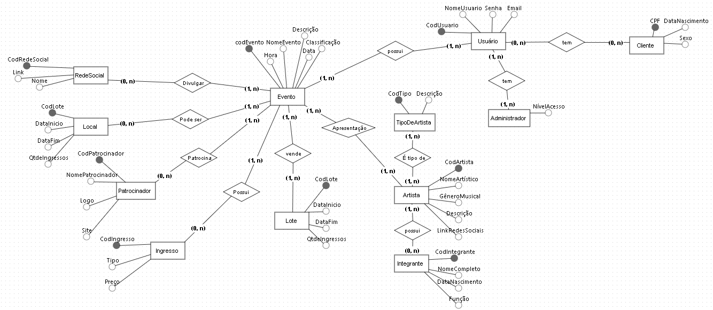

# MusicFest: Sistema de Gestão de Eventos Musicais

### 1. Introdução

O MusicFest é um sistema de gestão de eventos musicais projetado para otimizar o planejamento, organização e controle de festivais e shows. Este documento apresenta a estrutura da base de dados do sistema, descrevendo as entidades, seus atributos, os relacionamentos entre elas, e os requisitos funcionais e não funcionais do sistema.  O MusicFest visa proporcionar aos organizadores, artistas e público uma plataforma unificada e eficiente para gerenciar todos os aspectos de um evento musical.

### 2. Modelagem Conceitual

A modelagem conceitual de dados é fundamental para representar a estrutura da informação de forma clara e abstrata, independente de detalhes de implementação. No contexto do MusicFest, a modelagem conceitual, geralmente representada por um Diagrama de Entidade-Relacionamento (DER), define as principais entidades e seus relacionamentos, servindo como base para a construção do sistema.

### 3. Entidades e Atributos

**3.1 Artista:**

***CodArtista (Chave Primária):** Identificador único do artista.

***NomeArtístico:** Nome artístico do artista/banda.

***GêneroMusical:** Gênero musical predominante (ex.: Rock, Pop, MPB).

***Descrição:** Breve biografia ou descrição do artista.

***LinkRedesSociais:** Link para as redes sociais do artista.

**3.2 TipoDeArtista:**

***CodTipo (Chave Primária):** Identificador único do tipo de artista.

***Descrição:** Descrição do tipo de artista (ex.: Banda, Cantor Solo, DJ).

**3.3 Integrante:**

***CodIntegrante (Chave Primária):** Identificador único do integrante.

***NomeCompleto:** Nome completo do integrante.

***DataNascimento:** Data de nascimento do integrante.

***Função:** Função do integrante na banda/grupo (ex.: Vocalista, Guitarrista).

**3.4 Evento:**

***CodEvento (Chave Primária):** Identificador único do evento.

***NomeEvento:** Nome do evento (ex.: Rock in Rio, Festival de Inverno).

***Data:** Data de realização do evento.

***Hora:** Horário de início do evento.

***Classificação:** Classificação indicativa do evento.

***Descrição:** Descrição detalhada do evento.

**3.5 Local:**

***CodLocal (Chave Primária):** Identificador único do local.

***NomeLocal:** Nome do local (ex.: Estádio do Maracanã, Parque Ibirapuera).

***Capacidade:** Capacidade máxima de público do local.

***Endereço:** Endereço completo do local.

***Telefone:** Telefone para contato do local.

**3.6 Ingresso:**

***CodIngresso (Chave Primária):** Identificador único do ingresso.

***Tipo:** Tipo de ingresso (ex.: Inteira, Meia-Entrada, Camarote).

***Preço:** Valor do ingresso.

**3.7 Lote:**

***CodLote (Chave Primária):** Identificador único do lote de ingressos.

***DataInicio:** Data de início das vendas do lote.

***DataFim:** Data de término das vendas do lote.

***QtdeIngressos:** Quantidade de ingressos disponíveis neste lote.

**3.8 Patrocinador:**

***CodPatrocinador (Chave Primária):** Identificador único do patrocinador.

***NomePatrocinador:** Nome da empresa/instituição patrocinadora.

***Logo:** Caminho para o arquivo de imagem da logo do patrocinador.

***Site:** URL do site do patrocinador.

**3.9 RedeSocial:**

***CodRedeSocial (Chave Primária):** Identificador único da rede social.

***Nome:** Nome da rede social (ex.: Facebook, Instagram).

***Link:** Link para a página do evento na rede social.

**3.10 Usuário:**

***CodUsuario (Chave Primária):** Identificador único do usuário.

***NomeUsuario:** Nome de usuário para login.

***Senha:** Senha de acesso ao sistema.

***Email:** Endereço de email do usuário.

**3.11 Cliente (Especialização de Usuário):**

***CPF (Chave Primária):** CPF do cliente.

***DataNascimento:** Data de nascimento do cliente.

***Sexo:** Sexo do cliente.

**3.12 Administrador (Especialização de Usuário):**

***NívelAcesso:** Nível de acesso do administrador no sistema (ex.: Administrador, Operador).

### 4. Relacionamentos

***Apresentação (Artista N:M Evento):** Um artista pode se apresentar em vários eventos, e um evento pode ter vários artistas.

***Possui (Artista 1:N Integrante):** Um artista (banda/grupo) possui um ou mais integrantes.

***Realizado em (Evento 1:1 Local):** Um evento é realizado em um único local.

***Possui (Evento 1:N Ingresso):** Um evento possui diversos ingressos.

***Patrocina (Evento 1:N Patrocinador):** Um evento pode ser patrocinado por vários patrocinadores.

***Divulgado em (Evento 1:N RedeSocial):** Um evento pode ser divulgado em várias redes sociais.

***Vende (Evento 1:N Lote):** Um evento vende ingressos em lotes.

***É tipo de (Artista 1:N TipoDeArtista):** Um artista pertence a um tipo de artista

[

    brmodeloweb](https://app.brmodeloweb.com/#!/publicview/671be44af7b37bf132fb2d13)

<divstyle="text-align: center;">

    `<em>`Figura 1: Descrição da Imagem.`</em>`

### 5. Casos de Uso

Descrevemos a seguir os casos de uso do sistema, que ilustram as interações entre os atores (usuários) e o sistema MusicFest.

**5.1. Gerenciar Usuário**

***ID:** UC01

***Ator:** Cliente, Administrador

***Descrição:** O sistema deve permitir que clientes se cadastrem, efetuem login, visualizem e editem seus dados. Administradores podem ter acesso a funcionalidades adicionais, como gerenciar outros usuários, dependendo de seu nível de acesso.

**5.2. Gerenciar Artistas**

***ID:** UC02

***Ator:** Administrador

***Descrição:**  Administradores devem ser capazes de cadastrar novos artistas, editar informações existentes de artistas, adicionar ou remover membros de bandas e gerenciar os links para as redes sociais do artista.

**5.3. Gerenciar Eventos**

***ID:** UC03

***Ator:** Administrador

***Descrição:** Administradores devem ter a capacidade de criar, editar e cancelar eventos, incluindo a definição de detalhes como data, horário, local, descrição, classificação indicativa, preços de ingressos, lotes de venda e a associação de artistas e patrocinadores ao evento.

**5.4. Comprar Ingressos**

***ID:** UC04

***Ator:** Cliente

***Descrição:** Clientes autenticados devem poder navegar pelos eventos disponíveis, visualizar detalhes do evento, selecionar o tipo e quantidade de ingressos desejados e concluir a compra através do sistema.

**5.5. Gerar Relatórios**

***ID:** UC05

***Ator:** Administrador

***Descrição:** O sistema deve fornecer aos administradores a funcionalidade de gerar relatórios diversos, como relatórios de venda de ingressos por evento, tipo de ingresso e período, relatórios sobre o histórico de compras dos clientes, e outros relatórios que auxiliem na análise e tomada de decisão.

### 6. Requisitos

#### 6.1. Requisitos Funcionais

| ID     | Descrição                                                                                                                            | Prioridade | Caso de uso relacionado |

| ------ | -------------------------------------------------------------------------------------------------------------------------------------- | ---------- | ----------------------- |

| [RF01] | Permitir o cadastro e login de clientes e administradores.                                                                             | Alta       | [UC01]                  |

| [RF02] | Gerenciar perfis de usuários e níveis de acesso.                                                                                     | Alta       | [UC01]                  |

| [RF03] | Cadastrar, editar e excluir artistas/bandas, informações de contato, membros e redes sociais.                                        | Alta       | [UC02]                  |

| [RF04] | Associar artistas a eventos e definir o tipo de artista.                                                                               | Alta       | [UC02], [UC03]          |

| [RF05] | Criar, editar e cancelar eventos, definindo data, horário, local, classificação, descrição, ingressos, patrocinadores e artistas. | Alta       | [UC03]                  |

| [RF06] | Definir tipos de ingressos, preços e controlar o estoque por tipo, lote e evento.                                                     | Alta       | [UC03], [UC04]          |

| [RF07] | Gerenciar a venda e emissão de ingressos (online/offline) e gerar relatórios de vendas.                                              | Alta       | [UC04], [UC05]          |

| [RF08] | Cadastrar, editar e excluir locais de eventos, gerenciando informações de contato, capacidade e endereço.                           | Alta       | [UC03]                  |

| [RF09] | Cadastrar, editar e excluir patrocinadores, gerenciando informações de contato, logo e site.                                         | Alta       | [UC03]                  |

| [RF10] | Gerar relatórios de vendas de ingressos, analisar dados de eventos e gerar relatórios de clientes.                                   | Média     | [UC05]                  |

#### 6.2. Requisitos Não Funcionais

| ID      | Descrição                                                                                                                            | Prioridade |

| ------- | -------------------------------------------------------------------------------------------------------------------------------------- | ---------- |

| [RNF01] | O sistema deve ser responsivo e realizar as operações com tempo de resposta inferior a 3 segundos.                                   | Alta       |

| [RNF02] | Suportar um alto volume de acessos simultâneos durante a venda de ingressos.                                                          | Alta       |

| [RNF03] | Garantir a segurança e integridade dos dados armazenados, utilizando mecanismos de autenticação, controle de acesso e criptografia. | Alta       |

| [RNF04] | Processar as transações financeiras através de plataformas seguras.                                                                 | Alta       |

| [RNF05] | Possuir interface intuitiva e fácil de usar para todos os tipos de usuários.                                                         | Alta       |

| [RNF06] | Estar disponível 24 horas por dia, 7 dias por semana, exceto por manutenções programadas.                                           | Alta       |

| [RNF07] | Ser escalável para atender ao crescimento futuro da plataforma e demanda por eventos.                                                 | Média     |

### 7. Importância da Estrutura

A estrutura relacional da base de dados do MusicFest,  detalhada nas seções anteriores, garante a integridade e consistência dos dados. O sistema se beneficia da escalabilidade e flexibilidade, permitindo sua adaptação a diferentes portes de eventos e necessidades específicas de gestão. Através de uma interface amigável e funcionalidades intuitivas, o MusicFest tem o potencial de se consolidar como uma ferramenta essencial no universo da música.

| Nome           | Versão  | Observação           |

|----------------|---------|----------------------|

| itallo gravina | 1.0     | Criação do documento |
